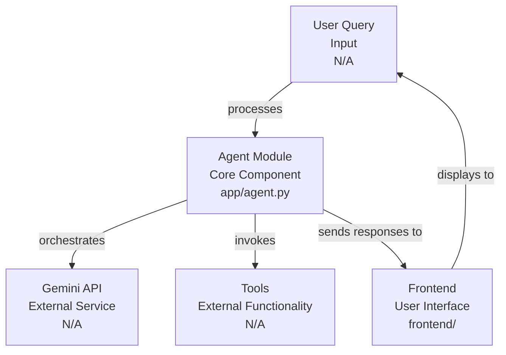
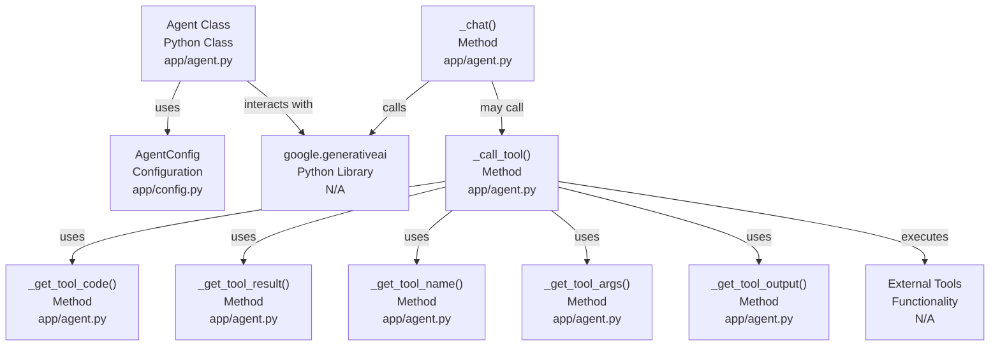

# Codebase Research Report

## Query
Investigate the "Agent Module" component in detail. Focus your analysis on these key files:
1. agent.py (gemini-fullstack/app/agent.py)

Provide insights about the component's main responsibilities and functionality and how it integrates with other system components

## Answer
# Agent Module Analysis

## High-Level Architecture

The **Agent Module** is a core component responsible for orchestrating interactions with the Gemini API and managing the agent's state and capabilities. It acts as the central hub for processing user queries, invoking tools, and generating responses. It integrates with the frontend for user interaction and potentially with other backend services for specific functionalities.

## Agent Module: `agent.py`

The primary file for the **Agent Module** is [agent.py](app/agent.py). This file defines the core `Agent` class, which encapsulates the logic for handling chat sessions, tool execution, and response generation.

### Main Responsibilities and Functionality

The `Agent` class in [agent.py](app/agent.py) is responsible for:

*   **Initialization and Configuration**: Setting up the Gemini model, tools, and chat session based on provided configurations. This involves importing and utilizing classes from the `google.generativeai` library.
*   **Chat Management**: Maintaining the chat history and interacting with the Gemini model to generate responses. The `_chat` method handles the core chat loop.
*   **Tool Invocation**: Dynamically calling external tools based on the model's output. The `_call_tool` method is crucial for this functionality, using a dictionary of available tools.
*   **Response Generation**: Processing the model's responses, including tool outputs, and formatting them for the user.
*   **Error Handling**: Managing exceptions that may occur during API calls or tool execution.

### Internal Parts

The `Agent` class contains several key methods and attributes:

*   `__init__(self, config: AgentConfig)`: Initializes the agent with a given [AgentConfig](app/config.py). It sets up the Gemini model and a dictionary of available tools.
*   `_chat(self, message: str)`: The main method for handling a single turn of conversation. It sends the user's message to the Gemini model and processes the model's response, including potential tool calls.
*   `_call_tool(self, tool_call: ToolCode)`: Executes a specific tool based on the `tool_call` object received from the Gemini model. It uses a dictionary of registered tools to find and invoke the correct function.
*   `_get_tool_code(self, tool_call: ToolCode)`: Retrieves the code to be executed for a given tool call.
*   `_get_tool_result(self, tool_call: ToolCode)`: Executes the tool code and returns the result.
*   `_get_tool_name(self, tool_call: ToolCode)`: Extracts the name of the tool from the tool call.
*   `_get_tool_args(self, tool_call: ToolCode)`: Extracts the arguments for the tool from the tool call.
*   `_get_tool_output(self, tool_call: ToolCode, tool_result: Any)`: Formats the tool output for the chat history.

### External Relationships

The **Agent Module** integrates with other system components in the following ways:

*   **Configuration**: It depends on the [AgentConfig](app/config.py) class defined in [config.py](app/config.py) to load necessary settings, such as the Gemini API key and available tools.
*   **Gemini API**: It directly interacts with the `google.generativeai` library to communicate with the Gemini model. This is evident in the import `import google.generativeai as genai` in [agent.py](app/agent.py:10) and the use of `genai.GenerativeModel` and `chat.send_message`.
*   **Tools**: The agent dynamically calls external tools. The specific tools are registered within the `Agent` class, and their implementations are expected to be available and callable. The `_call_tool` method acts as an interface to these external functionalities.
*   **Frontend (Implicit)**: While not directly shown in `agent.py`, the agent's responses and chat history are consumed by a frontend application (likely the React application in the `frontend/` directory) for display to the user. The `start-backend.sh` script suggests a backend server that would expose the agent's functionality via an API.

---
*Generated by [CodeViz.ai](https://codeviz.ai) on 10/07/2025, 07:23:14*
