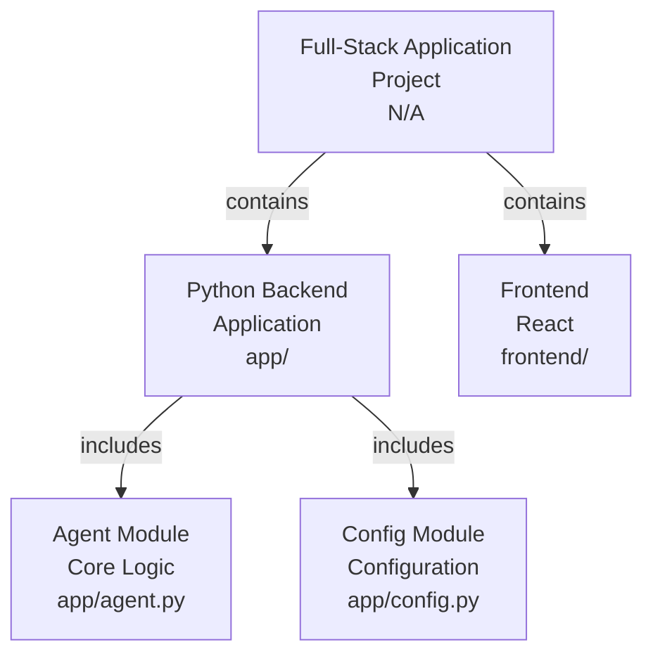
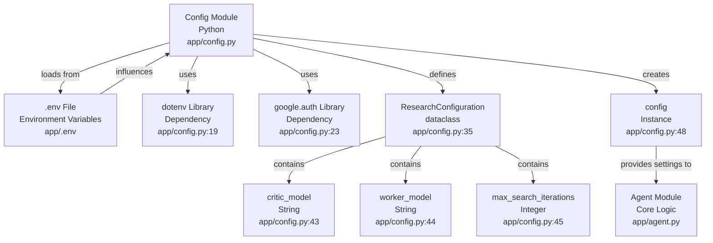

# Codebase Research Report

## Query
Investigate the "Config Module" component in detail. Focus your analysis on these key files:
1. config.py (gemini-fullstack/app/config.py)

Provide insights about the component's main responsibilities and functionality and how it integrates with other system components

## Answer
# Codebase Analysis Report

## High-Level Architecture

This project appears to be a full-stack application with a Python backend and a frontend (likely React, given the `frontend` directory structure). The backend, specifically the `app` directory, contains the core logic, including an [agent](app/agent.py) and a **Config Module**. The **Config Module** is responsible for managing application-wide settings, particularly those related to AI model configuration and Google Cloud authentication.

## Config Module

The **Config Module**, primarily defined in [app/config.py](app/config.py), serves as the central hub for managing application configurations. Its main responsibilities include:

*   **Environment Variable Loading**: It loads environment variables from a [.env file](app/.env) if present, allowing for flexible configuration without hardcoding sensitive information or frequently changing parameters. This is handled by the `dotenv` library [app/config.py:19](app/config.py:19).
*   **Google Cloud Authentication**: It attempts to obtain default Google Cloud credentials, especially when configured to use Vertex AI. This ensures that the application can authenticate with Google Cloud services. It uses the `google.auth` library for this purpose [app/config.py:23](app/config.py:23).
*   **AI Model Configuration**: It defines and manages parameters for AI models used in research-related tasks, such as the critic model, worker model, and maximum search iterations.

### Internal Structure

The **Config Module** utilizes a `dataclass` named `ResearchConfiguration` to structure and manage AI-related settings [app/config.py:35](app/config.py:35). This dataclass provides:

*   `critic_model` (str): Specifies the model to be used for evaluation tasks, defaulting to "gemini-2.5-pro" [app/config.py:43](app/config.py:43).
*   `worker_model` (str): Specifies the model for working or generation tasks, defaulting to "gemini-2.5-flash" [app/config.py:44](app/config.py:44).
*   `max_search_iterations` (int): Sets the maximum number of search iterations allowed, defaulting to 5 [app/config.py:45](app/config.py:45).

An instance of this `ResearchConfiguration` is created as `config` [app/config.py:48](app/config.py:48), making these settings readily available throughout the application.

### Integration with Other System Components

The **Config Module** integrates with other system components primarily through:

*   **Environment Variables**: By loading and setting environment variables (e.g., `GOOGLE_GENAI_USE_VERTEXAI`, `GOOGLE_CLOUD_PROJECT`, `GOOGLE_CLOUD_LOCATION`), it influences how other parts of the application, particularly those interacting with Google Generative AI services, behave. For example, the `GOOGLE_GENAI_USE_VERTEXAI` variable determines whether AI Studio credentials or Vertex AI are used [app/config.py:12](app/config.py:12), [app/config.py:22](app/config.py:22).
*   **Shared Configuration Object**: The `config` object (an instance of `ResearchConfiguration`) provides a centralized and easily accessible way for other modules, such as the [agent](app/agent.py), to retrieve AI model names and other research-related parameters. This promotes consistency and simplifies updates to these settings.

---
*Generated by [CodeViz.ai](https://codeviz.ai) on 10/07/2025, 07:33:14*
