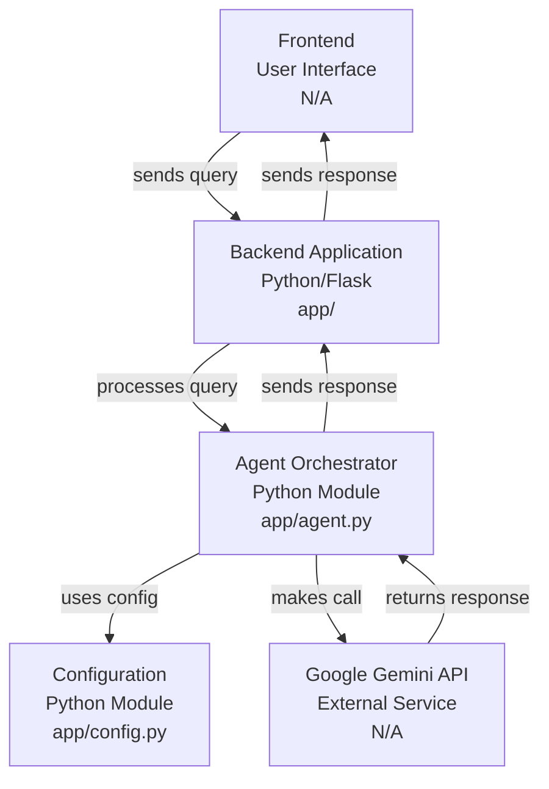
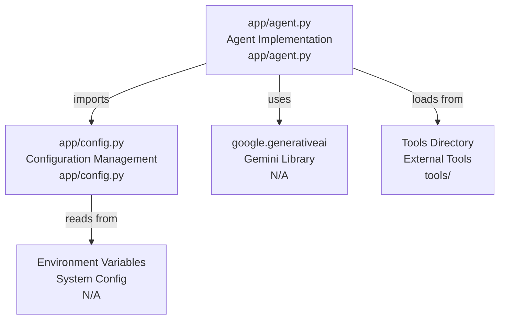
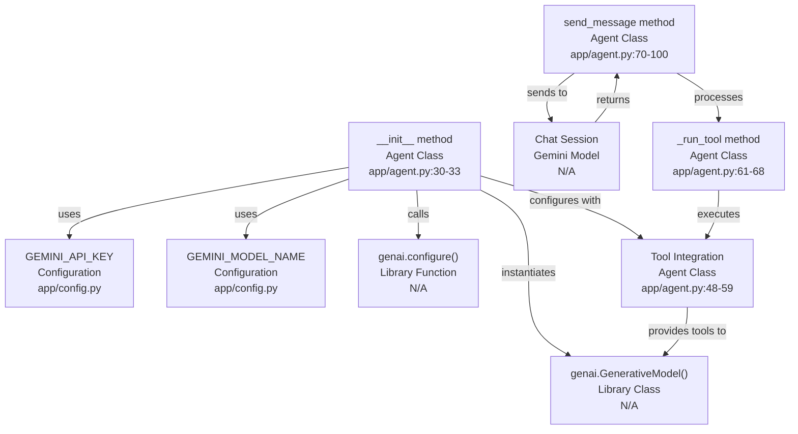

# Codebase Research Report

## Query
Investigate the "Gemini API" component in detail. Provide a comprehensive analysis of its architecture, responsibilities, and implementation details.

## Answer
# Gemini API Component Analysis

The "Gemini API" component within this project primarily refers to the integration and usage of the Google Gemini API for AI model interactions. It is central to the agent's ability to process natural language, generate responses, and potentially perform actions based on AI capabilities.

## High-Level Architecture




The **Gemini API** integration is handled within the backend application, specifically within the [app/agent.py](app/agent.py) module. This module acts as the core orchestrator for AI interactions, leveraging the `google.generativeai` library to communicate with the Gemini models. The configuration for this interaction, including API keys and model names, is managed separately in [app/config.py](app/config.py).

The overall flow involves:
1. The frontend sending user queries to the backend.
2. The backend ([app/agent.py](app/agent.py)) processing these queries, potentially enriching them with context or tools.
3. The backend making calls to the Gemini API using the configured model.
4. The Gemini API returning responses, which are then processed and sent back to the frontend.

## Mid-Level Component Interaction




### **`app/agent.py` - Agent Implementation**

The [agent.py](app/agent.py) file is the primary entry point for interactions with the Gemini API. It defines the `Agent` class, which encapsulates the logic for initializing the Gemini model, handling chat sessions, and executing tools.

*   **Purpose:** To provide an interface for interacting with the Gemini AI model, managing chat history, and integrating with external tools.
*   **Internal Parts:**
    *   `Agent` class: The main class responsible for AI interactions.
    *   `__init__` method: Initializes the Gemini model using `genai.GenerativeModel` and sets up the chat session. It also loads tools from the `tools` directory.
    *   `_get_model` method: A helper method to retrieve the Gemini model instance.
    *   `_get_chat` method: Manages the chat session, including history.
    *   `_get_tools` method: Discovers and loads available tools for the Gemini model.
    *   `_get_tool_code` method: Retrieves the code for a specific tool.
    *   `_run_tool` method: Executes a given tool with provided arguments.
    *   `send_message` method: The core method for sending messages to the Gemini model and processing its responses, including tool execution.
*   **External Relationships:**
    *   **`google.generativeai` library:** Directly interacts with the Gemini API through this library for model instantiation and chat operations.
    *   **`app.config`:** Imports configuration settings, particularly the `GEMINI_API_KEY` and `GEMINI_MODEL_NAME`, from [app/config.py](app/config.py).
    *   **Tools:** Dynamically loads and executes tools defined in the `tools` directory, which can extend the agent's capabilities.

### **`app/config.py` - Configuration Management**

The [config.py](app/config.py) file is responsible for loading environment variables and providing configuration settings for the application, including those related to the Gemini API.

*   **Purpose:** To centralize and manage application-wide configuration, ensuring sensitive information like API keys are loaded securely from environment variables.
*   **Internal Parts:**
    *   `load_dotenv()`: Loads environment variables from a `.env` file.
    *   `GEMINI_API_KEY`: Retrieves the Gemini API key from environment variables.
    *   `GEMINI_MODEL_NAME`: Retrieves the Gemini model name from environment variables.
*   **External Relationships:**
    *   **Environment Variables:** Reads `GEMINI_API_KEY` and `GEMINI_MODEL_NAME` from the system's environment or a `.env` file.
    *   **`app/agent.py`:** Provides the necessary API key and model name to the `Agent` class for initializing the Gemini model.

## Low-Level Implementation Details




### Gemini Model Initialization

The Gemini model is initialized within the `Agent` class's `__init__` method in [app/agent.py](app/agent.py:30-33).

```python
genai.configure(api_key=config.GEMINI_API_KEY)
self.model = genai.GenerativeModel(
    model_name=config.GEMINI_MODEL_NAME, tools=self._get_tools()
)
```

This snippet demonstrates:
*   `genai.configure(api_key=config.GEMINI_API_KEY)`: Sets up the global API key for the `google.generativeai` library, enabling authentication with the Gemini API.
*   `genai.GenerativeModel(...)`: Instantiates the generative model. The `model_name` is fetched from `config.GEMINI_MODEL_NAME`, allowing for easy switching between different Gemini models (e.g., `gemini-pro`, `gemini-1.5-pro-latest`). The `tools` argument is crucial for enabling function calling capabilities, allowing the AI to invoke predefined tools.

### Sending Messages and Processing Responses

The core interaction with the Gemini API happens in the `send_message` method of the `Agent` class in [app/agent.py](app/agent.py:70-100).

```python
response = self.chat.send_message(message)
```

This line sends the user's message to the Gemini model. The `response` object contains the model's reply, which can be a text response or a tool call. The `send_message` method then iterates through the `response.candidates` and `response.parts` to handle different types of responses:

*   **Text Responses:** If `part.text` is present, it's directly added to the chat history and returned.
*   **Tool Calls:** If `part.function_call` is present, the agent identifies the tool name and arguments, retrieves the tool's code using `_get_tool_code`, executes it using `_run_tool`, and then sends the tool's output back to the Gemini model for further processing. This forms a crucial loop for enabling the agent to perform actions.

### Tool Integration

The Gemini API integration heavily relies on the concept of "tools" or "function calling." The `_get_tools` method in [app/agent.py](app/agent.py:48-59) dynamically discovers and loads tool definitions from the `tools` directory. These tool definitions are then passed to the `GenerativeModel` during initialization, allowing the Gemini model to understand and invoke these functions when appropriate.

The `_run_tool` method in [app/agent.py](app/agent.py:61-68) is responsible for executing the Python code associated with a tool call. This allows the Gemini model to interact with the external environment and perform actions beyond just generating text.

---
*Generated by [CodeViz.ai](https://codeviz.ai) on 10/07/2025, 07:34:32*
