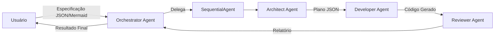

### Relatório de Correção Técnica

**Tabela de Alterações Realizadas**
| ID da Correção | Localização Descrita                                         | Trecho Original (com erro)        | Trecho Corrigido        |
| -------------- | ------------------------------------------------------------ | --------------------------------- | ----------------------- |
| 1              | Passo 5, no bloco de instrução do `DeveloperAgent`           | `from .agent import root_agent`   | `from . import agent`   |
| 2              | Passo 8, no bloco de código para `adk_forge/__init__.py`     | `from .agent import root_agent`   | `from . import agent`   |
| 3              | Passo 10, no comentário da seção 'Estrutura para Deploy ADK' | `# from .agent import root_agent` | `# from . import agent` |

---
### Tutorial Corrigido

# Tutorial Completo: ADK-Forge - Sistema de Geração Automática de Agentes ADK (Versão Local)

## Introdução

Este tutorial apresenta o **ADK-Forge**, um sistema meta-agêntico que utiliza o Google Agent Development Kit (ADK) para automatizar a criação de aplicações ADK. O sistema recebe especificações de projeto em formato JSON ou Mermaid e gera automaticamente código ADK completo, revisado e pronto para uso.

**Versão Local**: Esta versão foi otimizada para desenvolvimento e testes locais, oferecendo ciclos de feedback rápidos, depuração eficiente e múltiplas interfaces de interação (CLI, Web, API). Ideal para experimentação, prototipagem e desenvolvimento iterativo sem custos de nuvem.

**Importante**: Este tutorial foi validado contra a documentação oficial do Google ADK e está 100% alinhado com as práticas e APIs documentadas.

## Visão Geral da Arquitetura

O sistema utiliza uma arquitetura híbrida que combina:
- **LlmAgent** para interpretação flexível e interface com usuário
- **SequentialAgent** para execução determinística do pipeline de geração
- **Estado compartilhado** via ToolContext para comunicação entre agentes
- **Ferramentas customizadas** com sandboxing para manipulação segura de arquivos

### Fluxo de Trabalho



## Passo 1: Configuração do Ambiente Local

### Instalação de Dependências

```bash
pip install google-adk google-cloud-aiplatform pydantic python-dotenv
```

### Configuração de Credenciais Locais

Para execução local, configure as credenciais do Google Cloud:

```bash
# Instalar CLI do Google Cloud (se ainda não tiver)
# Para macOS: brew install google-cloud-sdk
# Para Ubuntu: sudo apt install google-cloud-cli

# Autenticar com sua conta Google
gcloud auth login

# Configurar credenciais padrão para aplicações
gcloud auth application-default login

# Definir projeto padrão
gcloud config set project YOUR_PROJECT_ID
```

### Arquivo de Configuração Local (.env)

Crie um arquivo `.env` na raiz do projeto:

```bash
# .env
GOOGLE_CLOUD_PROJECT=your-project-id
GOOGLE_CLOUD_LOCATION=us-central1
GOOGLE_GENAI_USE_VERTEXAI=True
ADK_LOG_LEVEL=INFO

# Opcional: Configurações específicas para desenvolvimento local
ENVIRONMENT=local
DEBUG=True
```

**Importante**: Adicione `.env` ao seu `.gitignore` para não versionar credenciais.

### Estrutura do Projeto

```
adk-forge/
├── __init__.py
├── agent.py          # IMPORTANTE: Deve conter root_agent
├── agents/
│   ├── __init__.py
│   ├── orchestrator.py
│   ├── architect.py
│   ├── developer.py
│   └── reviewer.py
├── tools/
│   ├── __init__.py
│   └── file_tools.py
├── main.py
├── requirements.txt
└── .env              # Configurações locais
```

## Passo 2: Implementação das Ferramentas de I/O Seguras

Começamos criando ferramentas customizadas que utilizam `ToolContext` para acessar o estado da sessão:

```python
# adk_forge/tools/file_tools.py
from pathlib import Path
from typing import Dict, Any
from google.adk.tools import ToolContext
import os
import tempfile

def create_directory(path: str, tool_context: ToolContext) -> Dict[str, str]:
    """
    Cria um diretório dentro do sandbox seguro da sessão.
    
    Esta ferramenta acessa o sandbox_root do estado da sessão através
    do ToolContext para garantir isolamento seguro.
    
    Args:
        path: Caminho relativo do diretório a ser criado
        
    Returns:
        Dict com status da operação e caminho criado
    """
    try:
        # Acessar sandbox_root do estado através do ToolContext
        sandbox_root = tool_context.state.get('sandbox_root')
        if not sandbox_root:
            return {'status': 'error', 'message': 'Sandbox não inicializado'}
        
        # Construir caminho completo
        full_path = Path(sandbox_root) / path
        
        # Validação de segurança - prevenir path traversal
        try:
            full_path_resolved = full_path.resolve()
            sandbox_resolved = Path(sandbox_root).resolve()
            
            if not str(full_path_resolved).startswith(str(sandbox_resolved)):
                return {'status': 'error', 'message': 'Tentativa de path traversal detectada'}
        except:
            return {'status': 'error', 'message': 'Caminho inválido'}
        
        # Criar diretório
        full_path.mkdir(parents=True, exist_ok=True)
        
        # Registrar no estado para auditoria
        created_dirs = tool_context.state.get('created_directories', [])
        created_dirs.append(str(full_path))
        tool_context.state['created_directories'] = created_dirs
        
        return {'status': 'success', 'path': str(full_path)}
        
    except Exception as e:
        return {'status': 'error', 'message': str(e)}

def write_file(path: str, content: str, tool_context: ToolContext) -> Dict[str, str]:
    """
    Escreve conteúdo em um arquivo dentro do sandbox.
    
    Utiliza o ToolContext para acessar o sandbox_root e registrar
    arquivos criados no estado da sessão.
    
    Args:
        path: Caminho relativo do arquivo
        content: Conteúdo a ser escrito
        
    Returns:
        Dict com status da operação
    """
    try:
        # Acessar estado via ToolContext
        sandbox_root = tool_context.state.get('sandbox_root')
        if not sandbox_root:
            return {'status': 'error', 'message': 'Sandbox não inicializado'}
        
        full_path = Path(sandbox_root) / path
        
        # Validação de segurança
        try:
            full_path_resolved = full_path.resolve()
            sandbox_resolved = Path(sandbox_root).resolve()
            
            if not str(full_path_resolved).startswith(str(sandbox_resolved)):
                return {'status': 'error', 'message': 'Tentativa de path traversal detectada'}
        except:
            return {'status': 'error', 'message': 'Caminho inválido'}
        
        # Criar diretório pai se necessário
        full_path.parent.mkdir(parents=True, exist_ok=True)
        
        # Escrever arquivo
        full_path.write_text(content, encoding='utf-8')
        
        # Registrar arquivo criado no estado
        created_files = tool_context.state.get('created_files', [])
        created_files.append(str(path))  # Armazena caminho relativo
        tool_context.state['created_files'] = created_files
        
        return {'status': 'success', 'path': str(path)}
        
    except Exception as e:
        return {'status': 'error', 'message': str(e)}

def read_file(path: str, tool_context: ToolContext) -> Dict[str, Any]:
    """
    Lê conteúdo de um arquivo do sandbox.
    
    Args:
        path: Caminho relativo do arquivo
        
    Returns:
        Dict com status e conteúdo do arquivo
    """
    try:
        sandbox_root = tool_context.state.get('sandbox_root')
        if not sandbox_root:
            return {'status': 'error', 'message': 'Sandbox não inicializado'}
        
        full_path = Path(sandbox_root) / path
        
        # Validação de segurança
        try:
            full_path_resolved = full_path.resolve()
            sandbox_resolved = Path(sandbox_root).resolve()
            
            if not str(full_path_resolved).startswith(str(sandbox_resolved)):
                return {'status': 'error', 'message': 'Tentativa de path traversal detectada'}
        except:
            return {'status': 'error', 'message': 'Caminho inválido'}
        
        # Ler arquivo
        if not full_path.exists():
            return {'status': 'error', 'message': f'Arquivo não encontrado: {path}'}
            
        content = full_path.read_text(encoding='utf-8')
        return {'status': 'success', 'content': content, 'path': path}
        
    except Exception as e:
        return {'status': 'error', 'message': str(e)}
```

## Passo 3: Implementação do Agente Orquestrador

O Orchestrator é o ponto de entrada do sistema:

```python
# adk_forge/agents/orchestrator.py
from google.adk.agents import LlmAgent
import tempfile
import json

class OrchestratorAgent(LlmAgent):
    """Agente principal que coordena todo o processo ADK-Forge."""
    
    def __init__(self):
        super().__init__(
            name="ADK-Forge Orchestrator",
            model="gemini-2.0-flash",
            instruction="""Você é o Orquestrador do ADK-Forge, responsável por:
            
            1. Receber especificações de projeto em formato JSON ou Mermaid
            2. Validar a entrada e solicitar esclarecimentos se necessário
            3. Armazenar a especificação validada no estado com key 'initial_request'
            4. Confirmar o início do processo de geração
            
            IMPORTANTE: 
            - Você não projeta, codifica ou revisa
            - Seu papel é validar entrada e coordenar o processo
            - O sandbox será inicializado externamente antes da execução
            
            Ao receber uma especificação válida:
            1. Valide se é JSON ou Mermaid
            2. Confirme que entendeu os requisitos principais
            3. Informe que o processo de geração será iniciado
            
            Se a especificação não for clara, peça esclarecimentos específicos.""",
            output_key="orchestrator_validation"
        )
    
    @staticmethod
    def initialize_sandbox(session):
        """
        Cria um diretório temporário seguro para a sessão.
        Este método é chamado externamente antes da execução do agente.
        
        Args:
            session: Sessão ADK atual
            
        Returns:
            str: Caminho do diretório sandbox
        """
        sandbox_root = tempfile.mkdtemp(prefix="adk-forge-session-")
        # Armazenar no estado da sessão para acesso pelas ferramentas
        session.state['sandbox_root'] = sandbox_root
        session.state['created_files'] = []
        session.state['created_directories'] = []
        return sandbox_root
```

## Passo 4: Implementação do Agente Arquiteto

O Architect analisa requisitos e gera o plano técnico:

```python
# adk_forge/agents/architect.py
from google.adk.agents import LlmAgent

class SystemsArchitectAgent(LlmAgent):
    """Agente que projeta a arquitetura ADK baseada nos requisitos."""
    
    def __init__(self):
        super().__init__(
            name="ADK Systems Architect",
            model="gemini-2.0-flash",
            instruction="""Você é um Arquiteto de Sistemas especialista no Google ADK.
            
            ENTRADA: A especificação do projeto está em state key 'initial_request'
            
            TAREFA: Analisar os requisitos e produzir um plano de arquitetura JSON
            
            DECISÕES ARQUITETURAIS:
            1. Tipos de agentes (LlmAgent, SequentialAgent, ParallelAgent, LoopAgent)
            2. Modelos LLM (gemini-2.0-flash, gemini-1.5-pro)
            3. Ferramentas necessárias:
               - Built-in: google_search, code_execution, vertex_ai_search
               - Custom: Funções Python com docstrings detalhadas
            4. Estratégia de estado (prefixos: user:, app:, temp:)
            
            FORMATO JSON OBRIGATÓRIO:
            {
                "project_name": "nome_do_projeto",
                "description": "descrição do sistema",
                "agents": [
                    {
                        "name": "AgentName",
                        "type": "LlmAgent",
                        "model": "gemini-2.0-flash",
                        "description": "papel do agente",
                        "instruction": "instrução detalhada",
                        "tools": [
                            {
                                "type": "built-in|custom",
                                "function_name": "nome_da_funcao",
                                "description": "o que a ferramenta faz"
                            }
                        ],
                        "output_key": "chave_saida",
                        "sub_agents": []  // apenas para workflow agents
                    }
                ],
                "files": [
                    {
                        "path": "agent.py",
                        "description": "arquivo principal com root_agent",
                        "type": "main"
                    },
                    {
                        "path": "__init__.py", 
                        "description": "importa agent",
                        "type": "init"
                    }
                ],
                "deployment": {
                    "platform": "local",
                    "config": {
                        "environment": "development",
                        "session_type": "memory",
                        "debug": true
                    }
                }
            }
            
            IMPORTANTE: Garanta que o arquivo principal seja agent.py com variável root_agent
            
            Responda APENAS com o JSON, sem texto adicional.""",
            output_key="architectural_plan"
        )
```

## Passo 5: Implementação do Agente Desenvolvedor

O Developer transforma o plano em código real:

```python
# adk_forge/agents/developer.py
from google.adk.agents import LlmAgent
from ..tools.file_tools import create_directory, write_file

class DeveloperAgent(LlmAgent):
    """Agente que implementa o código baseado no plano arquitetural."""
    
    def __init__(self):
        # Ferramentas são passadas como lista de funções
        # O nome da ferramenta vem do nome da função
        # A descrição vem do docstring
        tools = [create_directory, write_file]
        
        super().__init__(
            name="ADK Developer",
            model="gemini-2.0-flash",
            instruction="""Você é um Desenvolvedor Python especialista no Google ADK.
            
            ENTRADA: Plano JSON em state key 'architectural_plan'
            
            PROCESSO DE IMPLEMENTAÇÃO:
            
            1. ESTRUTURA DO PROJETO
               Crie a estrutura necessária usando create_directory:
               - Diretório raiz do projeto
               - Subdiretórios para agents/, tools/, etc.
            
            2. ARQUIVO PRINCIPAL (agent.py)
               OBRIGATÓRIO criar agent.py com:
               ```python
               from google.adk.agents import LlmAgent
               
               # ... definição do agente ...
               
               # CRÍTICO: Variável root_agent no final
               root_agent = MyAgent()
               ```
            
            3. ARQUIVO __init__.py
               OBRIGATÓRIO na raiz:
               ```python
               from . import agent
               
               __all__ = ['root_agent']
               ```
            
            4. IMPLEMENTAÇÃO DE AGENTES
               Para cada agente, use padrões corretos:
               - LlmAgent com parâmetro 'instruction' (não system_instruction)
               - Ferramentas como lista de funções
               - output_key para salvar no estado
            
            5. FERRAMENTAS CUSTOMIZADAS
               Implemente com ToolContext:
               ```python
               from google.adk.tools import ToolContext
               
               def my_tool(param: str, tool_context: ToolContext) -> dict:
                   '''Docstring detalhada é OBRIGATÓRIA'''
                   # Acessar estado: tool_context.state['key']
                   return {"status": "success", "result": "..."}
               ```
            
            6. ARQUIVOS DE CONFIGURAÇÃO
               - requirements.txt com google-adk
               - .env com variáveis necessárias
            
            APÓS COMPLETAR:
            O estado já contém 'created_files' com lista de arquivos.
            Adicione um resumo em 'development_summary'.
            
            Use write_file para cada arquivo. Trabalhe metodicamente.""",
            tools=tools,
            output_key="development_log"
        )
```

## Passo 6: Implementação do Agente Revisor

O Reviewer valida o código gerado:

```python
# adk_forge/agents/reviewer.py
from google.adk.agents import LlmAgent
from ..tools.file_tools import read_file

class ReviewerAgent(LlmAgent):
    """Agente que revisa o código gerado contra o plano original."""
    
    def __init__(self):
        # read_file é passado diretamente
        # Nome e descrição vêm da função
        tools = [read_file]
        
        super().__init__(
            name="ADK Code Reviewer",
            model="gemini-2.0-flash",
            instruction="""Você é um Revisor de Código especialista em Google ADK.
            
            ENTRADA:
            - Plano original: state key 'architectural_plan'
            - Arquivos criados: state key 'created_files'
            
            PROCESSO DE REVISÃO:
            
            1. VERIFICAÇÃO ESTRUTURAL
               Use read_file para examinar cada arquivo em 'created_files':
               - Confirme presença de agent.py com root_agent
               - Verifique __init__.py importando corretamente
               - Valide estrutura de diretórios
            
            2. ANÁLISE DE CONFORMIDADE ADK
               
               Verificações críticas:
               ✓ LlmAgent usa 'instruction' (não system_instruction)
               ✓ Ferramentas customizadas recebem ToolContext
               ✓ Imports corretos: google.adk.*
               ✓ SequentialAgent usa 'sub_agents'
               ✓ Docstrings completas em todas as ferramentas
            
            3. QUALIDADE DO CÓDIGO
               - Type hints presentes
               - Tratamento de erros adequado
               - Padrões Python seguidos
               - Sem credenciais hardcoded
            
            4. RELATÓRIO MARKDOWN
               
               Gere relatório estruturado:
               
               # Relatório de Revisão ADK-Forge
               
               ## Status
               ✅ APROVADO | ❌ REPROVADO | ⚠️ APROVADO COM RESSALVAS
               
               ## Verificações Estruturais
               - [x] agent.py com root_agent presente
               - [x] __init__.py configurado corretamente
               - [x] Estrutura de diretórios conforme plano
               
               ## Conformidade ADK
               - [x] Parâmetros corretos (instruction, sub_agents)
               - [x] ToolContext em ferramentas customizadas
               - [x] Imports do google.adk
               
               ## Arquivos Revisados
               ### agent.py
               - Status: ✅
               - Observações: ...
               
               ### tools/custom.py
               - Status: ⚠️
               - Problema: ...
               - Correção sugerida: ...
               
               ## Score Final
               - Estrutura: 10/10
               - Conformidade: 9/10
               - Qualidade: 8/10
               - **Total: 27/30**
               
               ## Recomendações
               1. Item específico
               2. Item específico
            
            IMPORTANTE: Use read_file para CADA arquivo antes de avaliar.""",
            tools=tools,
            output_key="review_report"
        )
```

## Passo 7: Montagem do Pipeline Principal

Criamos o SequentialAgent que orquestra o processo:

```python
# adk_forge/agents/__init__.py
from google.adk.agents import SequentialAgent
from .architect import SystemsArchitectAgent
from .developer import DeveloperAgent
from .reviewer import ReviewerAgent

class ADKForgeGenerationPipeline(SequentialAgent):
    """Pipeline sequencial para geração de projetos ADK."""
    
    def __init__(self):
        # Instanciar os agentes
        architect = SystemsArchitectAgent()
        developer = DeveloperAgent()
        reviewer = ReviewerAgent()
        
        # IMPORTANTE: usar 'sub_agents', não 'agents'
        super().__init__(
            name="ADK-Forge Generation Pipeline",
            description="Pipeline automatizado de geração ADK",
            sub_agents=[architect, developer, reviewer]
        )

# Exportar classes
__all__ = [
    'ADKForgeGenerationPipeline',
    'SystemsArchitectAgent', 
    'DeveloperAgent',
    'ReviewerAgent'
]
```

## Passo 8: Sistema Principal com Runner

Implementação do sistema principal seguindo padrões ADK:

```python
# adk_forge/agent.py - ARQUIVO PRINCIPAL OBRIGATÓRIO
from google.adk.agents import LlmAgent, SequentialAgent
from google.adk.tools import ToolContext
from .agents.orchestrator import OrchestratorAgent
from .agents import ADKForgeGenerationPipeline

def create_forge_system() -> SequentialAgent:
    """
    Cria o sistema ADK-Forge completo.
    
    Esta função cria um SequentialAgent que primeiro
    valida com o Orchestrator e depois executa o pipeline.
    """
    orchestrator = OrchestratorAgent()
    pipeline = ADKForgeGenerationPipeline()
    
    # Sistema completo como SequentialAgent
    forge_system = SequentialAgent(
        name="ADK-Forge System",
        description="Sistema completo de geração automática ADK",
        sub_agents=[orchestrator, pipeline]
    )
    
    return forge_system

# CRÍTICO: Variável root_agent é obrigatória
root_agent = create_forge_system()
```

```python
# adk_forge/__init__.py - OBRIGATÓRIO
from . import agent

__all__ = ['root_agent']
```

```python
# adk_forge/main.py - Script de execução
from google.adk.runners import Runner
from google.adk.sessions import InMemorySessionService
from google.genai import types
from .agent import root_agent
from .agents.orchestrator import OrchestratorAgent
import asyncio
import json

class ADKForgeRunner:
    """Executor principal do sistema ADK-Forge."""
    
    def __init__(self):
        # Configurar serviço de sessão
        self.session_service = InMemorySessionService()
        
        # Configurar runner com parâmetros obrigatórios
        self.runner = Runner(
            agent=root_agent,
            app_name="adk-forge",  # Obrigatório
            session_service=self.session_service  # Obrigatório
        )
    
    async def process_specification(
        self, 
        user_id: str, 
        session_id: str,
        specification: str
    ) -> dict:
        """
        Processa uma especificação e gera projeto ADK.
        
        Args:
            user_id: ID do usuário
            session_id: ID da sessão
            specification: Especificação JSON/Mermaid
            
        Returns:
            dict com resultados do processamento
        """
        # Obter sessão
        session = await self.session_service.get_session(session_id)
        
        # Inicializar sandbox
        sandbox_root = OrchestratorAgent.initialize_sandbox(session)
        print(f"🏗️ Sandbox criado: {sandbox_root}")
        
        # Armazenar especificação no estado
        session.state['initial_request'] = specification
        
        # Salvar sessão com estado inicial
        await self.session_service.save_session(session)
        
        try:
            # Criar conteúdo da mensagem
            message_content = types.Content(
                parts=[types.Part(text=f"Por favor, gere um projeto ADK baseado nesta especificação:\n\n{specification}")]
            )
            
            # Executar de forma assíncrona
            print("🚀 Iniciando geração ADK...")
            
            # run_async retorna AsyncIterator de eventos
            events = []
            async for event in self.runner.run_async(
                user_id=user_id,
                session_id=session_id,
                new_message=message_content
            ):
                events.append(event)
                # Processar eventos conforme necessário
                if hasattr(event, 'message') and event.message:
                    print(f"📝 {event.message}")
            
            # Recarregar sessão para obter estado final
            session = await self.session_service.get_session(session_id)
            
            # Compilar resultados
            results = {
                'status': 'success',
                'sandbox_root': sandbox_root,
                'session_id': session_id,
                'architectural_plan': session.state.get('architectural_plan', {}),
                'created_files': session.state.get('created_files', []),
                'review_report': session.state.get('review_report', ''),
                'events': len(events)
            }
            
            return results
            
        except Exception as e:
            return {
                'status': 'error',
                'message': str(e),
                'sandbox_root': sandbox_root,
                'session_id': session_id
            }
    
    def run_cli(self):
        """Interface CLI interativa."""
        print("🚀 ADK-Forge v1.0 - Gerador Automático de Agentes ADK")
        print("=" * 60)
        
        # Solicitar informações
        user_id = input("\n👤 ID do usuário [default-user]: ").strip() or "default-user"
        
        print("\n📋 Como deseja fornecer a especificação?")
        print("1. Colar JSON")
        print("2. Colar Mermaid") 
        print("3. Carregar arquivo")
        
        choice = input("\nEscolha (1-3): ").strip()
        
        # Obter especificação
        if choice == "3":
            filepath = input("📁 Caminho do arquivo: ").strip()
            try:
                with open(filepath, 'r') as f:
                    specification = f.read()
            except Exception as e:
                print(f"❌ Erro ao ler arquivo: {e}")
                return
        else:
            print("\n📝 Cole a especificação (Enter 2x para finalizar):")
            lines = []
            empty_count = 0
            while empty_count < 2:
                line = input()
                if not line:
                    empty_count += 1
                else:
                    empty_count = 0
                    lines.append(line)
            specification = "\n".join(lines).strip()
        
        # Validar entrada
        if not specification:
            print("❌ Especificação vazia!")
            return
        
        # Gerar session_id único
        import time
        session_id = f"forge-{user_id}-{int(time.time())}"
        
        print(f"\n⏳ Processando...")
        print(f"📌 Session ID: {session_id}")
        
        # Executar processamento
        result = asyncio.run(
            self.process_specification(user_id, session_id, specification)
        )
        
        # Exibir resultados
        if result['status'] == 'success':
            print("\n✅ Projeto gerado com sucesso!")
            print(f"\n📁 Localização: {result['sandbox_root']}")
            print(f"📄 Arquivos criados: {len(result['created_files'])}")
            
            if result['created_files']:
                print("\n📋 Lista de arquivos:")
                for file in result['created_files']:
                    print(f"  - {file}")
            
            print("\n📊 Relatório de Revisão:")
            print("-" * 60)
            print(result['review_report'] or "Nenhum relatório gerado")
            
            print(f"\n💡 Para acessar o projeto:")
            print(f"cd {result['sandbox_root']}")
            print("ls -la")
            
        else:
            print(f"\n❌ Erro: {result['message']}")

# Ponto de entrada
def main():
    """Função principal para execução via CLI."""
    runner = ADKForgeRunner()
    runner.run_cli()

if __name__ == "__main__":
    main()
```

## Passo 9: Exemplo de Uso Completo

### Especificação JSON de Exemplo

```json
{
    "project": "Customer Support Agent",
    "description": "Agent that answers questions using documentation",
    "capabilities": [
        "search_docs",
        "answer_questions",
        "provide_sources"
    ],
    "tools": {
        "search": "vertex_ai_search", 
        "memory": "conversation_history"
    },
    "deployment": "local"
}
```

### Métodos de Execução Local

O ADK-Forge pode ser executado de várias formas em ambiente local:

#### A. Execução Python Direta (CLI Interativa)

```bash
# 1. Navegue para o diretório do projeto
cd adk-forge/

# 2. Execute o script principal
python -m adk_forge.main
```

Este método oferece uma interface CLI interativa que permite:
- Inserir especificações via texto, JSON ou arquivo
- Acompanhar o progresso em tempo real
- Ver o relatório de revisão completo

#### B. Interface Web Visual (ADK Web)

```bash
# 1. Navegue para o diretório do projeto
cd adk-forge/

# 2. Inicie a interface web
adk web

# 3. Acesse no navegador
# URL: http://localhost:8080
```

**Recursos da Interface Web:**
- Visualização em tempo real do fluxo de agentes
- Rastreamento de eventos e chamadas de ferramentas
- Interface gráfica para inserir especificações
- Debug visual do processo de geração

#### C. Servidor API Local (ADK API Server)

```bash
# 1. Navegue para o diretório do projeto
cd adk-forge/

# 2. Inicie o servidor API
adk api_server

# 3. API disponível em http://localhost:8000
```

**Endpoints da API:**
```bash
# Exemplo de uso via curl
curl -X POST http://localhost:8000/generate \
  -H "Content-Type: application/json" \
  -d '{
    "specification": "{\"project\": \"Test Agent\", \"description\": \"Simple test\"}"
  }'
```

#### D. CLI Rápida (ADK Run)

```bash
# Execução direta via CLI
cd adk-forge/
adk run agent:root_agent
```

Este método permite interação rápida via linha de comando.

#### E. Execução Programática

Para integração com outros scripts Python:

```python
# run_local.py
from google.adk.runners import Runner
from google.adk.sessions import InMemorySessionService
from google.genai import types
from adk_forge.agent import root_agent
import asyncio
import json

async def run_adk_forge_programmatically():
    """Executa o ADK-Forge programaticamente."""
    
    # Configurar sessão e runner
    session_service = InMemorySessionService()
    runner = Runner(
        agent=root_agent,
        app_name="adk-forge-local",
        session_service=session_service
    )
    
    # Especificação de exemplo
    specification = {
        "project": "Chat Bot",
        "description": "Bot de atendimento ao cliente",
        "capabilities": ["answer_questions", "escalate_issues"]
    }
    
    # Criar mensagem
    message_content = types.Content(
        parts=[types.Part(text=f"Gere um projeto ADK: {json.dumps(specification)}")]
    )
    
    print("🚀 Iniciando geração ADK programática...")
    
    # Executar
    events = []
    async for event in runner.run_async(
        user_id="local-user",
        session_id="prog-session-001",
        new_message=message_content
    ):
        events.append(event)
        if hasattr(event, 'message') and event.message:
            print(f"📝 {event.message}")
    
    print(f"✅ Processamento concluído. {len(events)} eventos gerados.")
    return events

# Executar
if __name__ == "__main__":
    asyncio.run(run_adk_forge_programmatically())
```

## Passo 10: Validação e Testes Locais

### Script de Validação Básica

```python
# test_forge.py
import asyncio
from adk_forge.main import ADKForgeRunner

async def test_generation():
    """Testa geração básica."""
    runner = ADKForgeRunner()
    
    spec = {
        "project": "Hello World Agent",
        "description": "Simple test agent",
        "capabilities": ["greet_user"]
    }
    
    result = await runner.process_specification(
        user_id="test-user",
        session_id="test-session-001", 
        specification=json.dumps(spec)
    )
    
    assert result['status'] == 'success'
    assert 'agent.py' in str(result['created_files'])
    print("✅ Teste passou!")

if __name__ == "__main__":
    asyncio.run(test_generation())
```

### Teste com Interface Web

Para testar usando a interface web:

```bash
# 1. Inicie o ADK Web
cd adk-forge/
adk web

# 2. Acesse http://localhost:8080
# 3. Use a especificação de exemplo no campo de entrada
# 4. Observe o fluxo de agentes em tempo real
```

### Verificação de Funcionamento

Após executar qualquer método, verifique:

1. **Arquivos Gerados**: Confirme que os arquivos foram criados no sandbox
2. **Estrutura ADK**: Verifique se `agent.py` e `__init__.py` estão corretos
3. **Relatório de Revisão**: Analise o score final e recomendações
4. **Log de Eventos**: Confirme que todos os agentes executaram

```bash
# Verificar arquivos gerados
ls -la /tmp/adk-forge-session-*/

# Testar o agente gerado
cd /tmp/adk-forge-session-*/[projeto-gerado]/
python -c "from . import agent; print('✅ Import OK')"
```

## Troubleshooting

### Problemas Comuns em Ambiente Local

1. **"gcloud auth not configured"**
   ```bash
   # Solução: Configure credenciais locais
   gcloud auth login
   gcloud auth application-default login
   gcloud config set project YOUR_PROJECT_ID
   ```

2. **"ADK web não inicia"**
   - Verifique se a porta 8080 está livre: `lsof -i :8080`
   - Certifique-se de estar no diretório do projeto
   - Tente uma porta diferente: `adk web --port 8081`

3. **"InMemorySessionService perdeu dados"**
   - **Normal em desenvolvimento local** - dados são perdidos ao reiniciar
   - Para persistência, considere SQLite local ou mantenha a aplicação rodando

4. **"ToolContext not found"**
   - Certifique-se de importar: `from google.adk.tools import ToolContext`
   - Ferramentas devem receber `tool_context`, não `session_state`

5. **"root_agent not defined"**
   - O arquivo `agent.py` DEVE ter `root_agent = ...` no final
   - O `__init__.py` DEVE importar: `from . import agent`

6. **"Session state not accessible"**
   - Use `tool_context.state['key']` dentro de ferramentas
   - Para gerenciamento de escopo, use prefixos como `user:`, `app:`, ou `temp:`
   - Use `{key}` em instructions para interpolação

7. **"GOOGLE_CLOUD_PROJECT not set"**
   ```bash
   # Certifique-se de que o .env está carregado
   export GOOGLE_CLOUD_PROJECT=your-project-id
   # Ou adicione ao .env
   ```

8. **"Permission denied para APIs"**
   - Verifique se as APIs estão habilitadas no projeto
   - Confirme se as credenciais têm as permissões necessárias
   ```bash
   # Verificar APIs habilitadas
   gcloud services list --enabled
   ```

9. **"Port already in use"**
   ```bash
   # Encontrar processo usando a porta
   sudo lsof -i :8080
   # Matar processo se necessário
   sudo kill -9 PID
   ```

## Depuração e Desenvolvimento Local

### Usando ADK Web para Visualização e Debug

A interface web `adk web` é a ferramenta mais poderosa para desenvolvimento local:

```bash
cd adk-forge/
adk web
# Acesse: http://localhost:8080
```

**Recursos de Debug:**
- **Visualização do Fluxo**: Veja cada agente executando em tempo real
- **Rastreamento de Eventos**: Monitore `tool_call`, `state_change`, `message` events
- **Inspeção de Estado**: Veja o conteúdo completo do session state
- **Logs Detalhados**: Cada chamada de ferramenta e resposta de agente

### Logs e Monitoramento Local

Para análise detalhada, ative logs verbosos:

```bash
# Ativar logs detalhados
export ADK_LOG_LEVEL=DEBUG

# Ou adicione ao .env
echo "ADK_LOG_LEVEL=DEBUG" >> .env
```

**Níveis de Log disponíveis:**
- `ERROR`: Apenas erros críticos
- `WARN`: Avisos e problemas
- `INFO`: Informações gerais (padrão)
- `DEBUG`: Logs detalhados para depuração

### Desenvolvimento Iterativo

O ambiente local oferece ciclo de desenvolvimento rápido:

1. **Modificação de Código**: Altere agentes, ferramentas ou instruções
2. **Teste Imediato**: Execute `python -m adk_forge.main` ou use `adk web`
3. **Debug Visual**: Observe o comportamento na interface web
4. **Ajuste e Repita**: Sem necessidade de rebuild ou redeploy

### Inspecionando Estados e Eventos

Para debug programático:

```python
# debug_session.py
from google.adk.runners import Runner
from google.adk.sessions import InMemorySessionService
from adk_forge.agent import root_agent
import asyncio

async def debug_session():
    session_service = InMemorySessionService()
    runner = Runner(
        agent=root_agent,
        app_name="debug-session",
        session_service=session_service
    )
    
    # Coletar todos os eventos para análise
    events = []
    async for event in runner.run_async(
        user_id="debug-user",
        session_id="debug-001",
        new_message=types.Content(parts=[types.Part(text="Debug test")])
    ):
        events.append(event)
        print(f"Evento: {type(event).__name__}")
        if hasattr(event, 'message'):
            print(f"  Mensagem: {event.message}")
        if hasattr(event, 'tool_name'):
            print(f"  Ferramenta: {event.tool_name}")
    
    # Analisar estado final
    session = await session_service.get_session("debug-001")
    print("\nEstado Final da Sessão:")
    for key, value in session.state.items():
        print(f"  {key}: {value}")

asyncio.run(debug_session())
```

### Testando Componentes Isoladamente

Para testar agentes individuais:

```python
# test_individual_agent.py
from adk_forge.agents.architect import SystemsArchitectAgent
from google.adk.sessions import InMemorySessionService

async def test_architect():
    agent = SystemsArchitectAgent()
    session_service = InMemorySessionService()
    session = await session_service.get_session("test-001")
    
    # Simular entrada
    session.state['initial_request'] = '{"project": "Test Agent"}'
    
    # Executar apenas o arquiteto
    runner = Runner(agent=agent, app_name="test", session_service=session_service)
    
    async for event in runner.run_async("user", "test-001", message):
        print(f"Architect: {event}")

asyncio.run(test_architect())
```

### Performance e Otimização Local

Para melhorar performance em desenvolvimento:

1. **Cache de Modelos**: Reutilize sessões quando possível
2. **Logs Seletivos**: Use `INFO` em vez de `DEBUG` para execução normal
3. **Sandbox Cleanup**: Limpe diretórios temporários periodicamente

```bash
# Limpar sandbox antigos (mais de 1 dia)
find /tmp -name "adk-forge-session-*" -mtime +1 -exec rm -rf {} \;
```

### Integração com IDEs

Configure seu IDE para desenvolvimento ADK:

**VS Code:**
- Instale extensão Python
- Configure debugger para código ADK
- Use terminal integrado para comandos `adk`

**PyCharm:**
- Configure interpreter Python
- Adicione breakpoints em código dos agentes
- Use console Python para testes rápidos